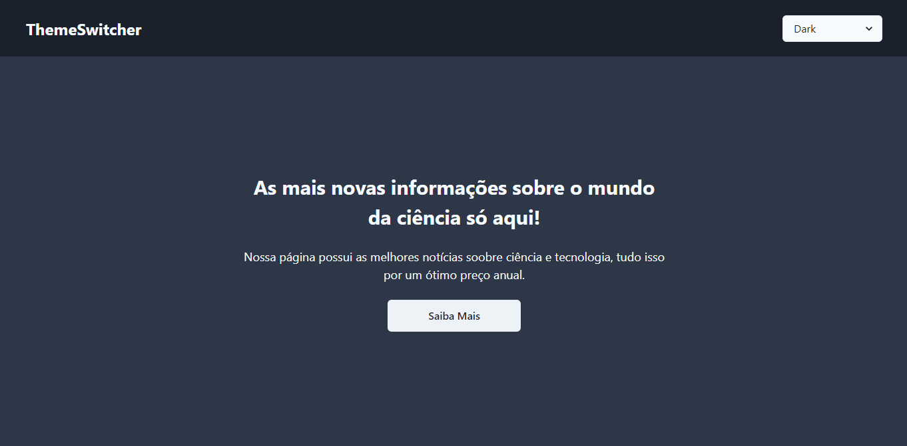

<h1 align="center"> theme-switcher-with-no-libs </h1>

  <a href="#-tecnologias">Tecnologias</a>&nbsp;&nbsp;&nbsp;|&nbsp;&nbsp;&nbsp;
  <a href="#-projeto">Projeto</a>&nbsp;&nbsp;&nbsp;|&nbsp;&nbsp;&nbsp;
  <a href="#memo-licença">Licença</a>

  

 

  

## 🚀 Tecnologias

Esse projeto foi desenvolvido com as seguintes tecnologias:

- ReactJS
- TypeScript
- ChackraUI

## 🔥 Algumas features neste projeto

- React Context API
- Estilização com ChakraUI
- Esquemas de temas com TypeScript

## ✨ Neste projeto você pode ver

- Um layout muito simples criado com ChakraUI.
- Um botão que quando clicado troca entre os temas escuro e claro.

## 💻 Projeto

- Esta é uma aplicação simples de troca de temas criado somente com React e ChakraUI

## 📝 Licença

Esse projeto está sob a licença MIT.

---
